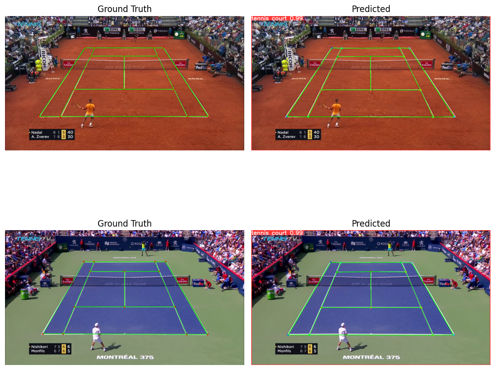

# git remote add origin git@github.com:AkaCoder404/TennisCourtDetectorwithYolov8.git
  git branch -M main
  git push -u origin main

## Background
Inspired by https://github.com/yastrebksv/TennisCourtDetector. Dataset can be found at this github. The goal is to see the performance of YoloV8 at the same task.



## Environment
```
Python 3.11.
torch 2.1.1
```

Training was done on Tesla V100-PCIE-16GB GPU for the upload `model.py`.

## Running
1. First download dataset and move to `datasets/` folder.
2. Run `convert_to_yolo.ipynb` to convert to coco8, the format supported by YOLOv8 ultralytics.
3. Run `python train.py`.


## Performance
We trained with `yolov8s-pose.pt` base model. The training results and visualizing methods of the dataset can be found in `evaluate.ipynb`.

### Epoch 10, Batch Size 16, Imgsz 640
```shell
Training time: 695.83 seconds
# model.val()
Ultralytics YOLOv8.0.217 🚀 Python-3.11.5 torch-2.1.1+cu121 CPU (AMD EPYC 7742 64-Core Processor)
val: Scanning /home/ltq/Documents/TennisCourtDetectorYoloV8/datasets/tennis_data/labels/val.cache... 2211 images, 0 backgrounds, 0 corrupt: 100%|██████████| 2211/2211 [00:00<?, ?it/s]
                 Class     Images  Instances      Box(P          R      mAP50  mAP50-95)     Pose(P          R      mAP50  mAP50-95): 100%|██████████| 139/139 [01:51<00:00,  1.24it/s]
                   all       2211       2211          1          1      0.995      0.995          0          0          0          0
Speed: 0.1ms preprocess, 31.5ms inference, 0.0ms loss, 0.4ms postprocess per image
Results saved to runs/pose/val2
map50-95 0.9949999999999999
map50 0.995
map75 0.995
maps [      0.995]
```


## Extra
